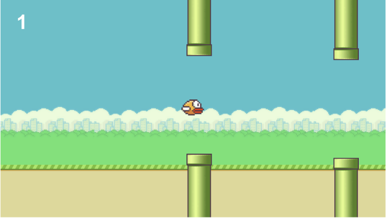

# Flappy Bird Clone

This is a clone of the classic game Flappy Bird, developed using [C#](https://www.w3schools.com/cs/cs_intro.php) and [Unity](https://unity.com/). The game follows the same mechanics as the original, where the player controls a bird by tapping the space bar to avoid pipes and score points by passing through gaps between them.

<div style="display:flex;">
  
  
</div>


## Table of Contents

- [Installation](#installation)
- [Usage](#usage)
- [Controls](#controls)
- [Contributing](#contributing)
- [License](#license)

## Installation

1. Clone the repository:

    ```
    git clone https://github.com/moerabaya/Flappy-Bird-Clone.git
    ```

2. Install Unity:
3. Open project in Unity

## Usage

Navigate to the project directory and run the following command to start the game:

